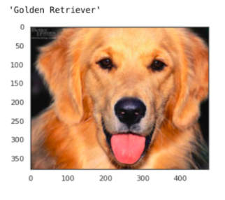

# Who Let The Dogs Out?

Connie Xiao
 
**A Dog Breed Identifier with Deep Learning and Computer Vision**

### Abstract
---

According to ASPCA, approximately 6.5 million animals enter U.S. animal shelters nationwide every year. Of those, approximately 3.3 million are dogs. About 1 in 10 dogs are returned to the shelter in 6 months due to destruction, behavior, and/or temperament issues. Animal shelters recevie stray/lost dogs on a daily basis, and it may be hard to classify what kind of breed they exactly are. If you go to a dog adoption website, you will often see their breed being listed as 'unknown' or 'mix'.

Upon adoption many new owners will be curious about their new furry friend's story, personality, and breed. It may be difficult to identify some dog breeds since they look similar to the human eye. Learning about their breed, we can better identify their temperament and behavior, and match them up with a perfect human companion. For example, if we identify a dog's breed we can also know whether they are shedders, hypoallergenic, active, or territorial. With this breed identifier algorithm, humans may be more proned to adopt and less likely to return dogs since more information is provided to them.

### Data
---

Data was collected from the Stanford Dog Dataset. The dataset came with 8351 dog images and 133 different breeds. The dataset was already split up into training, validation, and testing. There are 6680 training dog images, 835 validation dog images, 836 test dog images.

### Results 
--- 
A baseline model was made using convolutional layers, max pooling, and dropouts to classify the 133 classes. With my baseline model I was able to achieve an accuracy rate of 3.9%. Then transfer learning was applied to the dataset. I used 3 different methods of transfer learning: VGG16, ResNet50, and InceptionV3. Regularization with weight decay or L2, and dropout rates were introduced to the algorithm to reduce overfitting. VGG16 resulted in an accuracy of 76.3%, ResNet50 resulted in an
accuracy of 80.7%, and finally InceptionV3 resultedin an accuracy of 81.3%. Since InceptionV3 gave me the best score, I used InceptionV3 to produce the dog classifier alogrithm. Here are some of the image results:

### Tools
---

- OpenCV
- Keras
- Scikit-learn
- Tensorflow
- Matplotlib
- Seaborn
- Pandas
- Numpy
